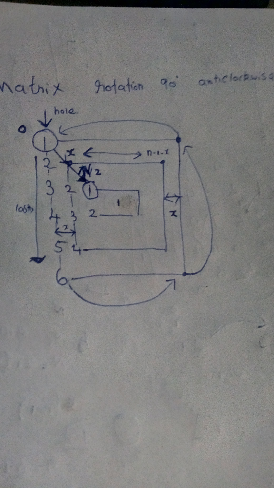

## Transpose

```
void transpose(int A[][N])
{
    for (int i = 0; i < N; i++)
        for (int j = i+1; j < N; j++)
            swap(A[i][j], A[j][i]);
}
```


## Matrix Rotation 90 - anti clockwise

```cpp
void rotateMatrix(int mat[][N])
{
    // Consider all squares one by one
    for (int x = 0; x < N / 2; x++)
    {
        // Consider elements in group of 4 in 
        // current square
        for (int y = x; y < N-x-1; y++)
        {
            // store current cell in temp variable
            int temp = mat[x][y];
 
            // move values from right to top
            mat[x][y] = mat[y][N-1-x];
 
            // move values from bottom to right
            mat[y][N-1-x] = mat[N-1-x][N-1-y];
 
            // move values from left to bottom
            mat[N-1-x][N-1-y] = mat[N-1-y][x];
 
            // assign temp to left
            mat[N-1-y][x] = temp;
        }
    }
}
```

